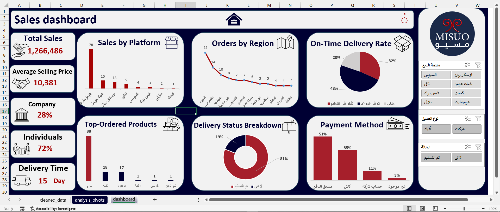

# 🛋️ Furniture Sales Dashboard — MISUO

> **End-to-end Excel analytics project**: raw data → cleaning → pivot analysis → interactive dashboard



---

## 📌 Project Overview

A complete sales analytics solution built for **MISUO (مسيو)**, a furniture retail business operating across multiple online platforms in Egypt. The project transforms messy transactional records into a fully interactive Excel dashboard that empowers management to monitor sales performance, delivery efficiency, and customer behavior at a glance.

---

## 🎯 Business Questions Answered

| # | Business Question |
|---|---|
| 1 | What is the total revenue and average selling price per order? |
| 2 | Which sales platform drives the most orders? |
| 3 | Which regions generate the highest order volume? |
| 4 | How is the delivery performance (on-time vs. delayed)? |
| 5 | What are the top-ordered product types? |
| 6 | What payment methods do customers prefer? |
| 7 | What is the split between individual and corporate customers? |

---

## 📊 Dashboard KPIs

| KPI | Value |
|---|---|
| 💰 Total Sales | **1,266,486 EGP** |
| 🏷️ Average Selling Price | **10,381 EGP** |
| 🚚 Average Delivery Time | **15 Days** |
| 🏢 Corporate Customers | **28%** |
| 👤 Individual Customers | **72%** |
| ✅ On-Time Delivery | **48%** |

---

## 📈 Dashboard Visuals

| Visual | Type | Insight |
|---|---|---|
| Sales by Platform | Bar Chart | Top platforms ranked by order count |
| Orders by Region | Line/Dot Chart | Geographic distribution across Egypt |
| On-Time Delivery Rate | Pie Chart | Delivered on-time vs. delayed vs. cancelled |
| Top-Ordered Products | Bar Chart | Most frequently ordered furniture items |
| Delivery Status Breakdown | Donut Chart | Delivered (81%) vs. Pending (19%) |
| Payment Method | Bar Chart | Prepaid (51%), Cash (35%), Account (11%), Other (3%) |

---

## 🗂️ Repository Structure

```
furniture-sales-dashboard/
│
├── furniture_sales_raw_dataset.xlsx   # Original raw data (Arabic, unstructured)
├── furniture_sales_dashboard.xlsx     # Cleaned data + pivot analysis + dashboard
├── dashboard.png                      # Dashboard screenshot
└── README.md
```

---

## 🔄 Workflow

```
Raw Data (البيانات)
       │
       ▼
 Data Cleaning (Power Query)
  - Removed duplicates & nulls
  - Standardized date formats
  - Derived new columns: customer type, delivery duration, order status
  - Calculated: scheduled vs. actual delivery time
       │
       ▼
 Pivot Analysis (analysis_pivots sheet)
  - Sales aggregation by platform, region, product
  - Delivery performance metrics
  - Payment method distribution
       │
       ▼
 Interactive Dashboard
  - Slicers: Platform | Customer Type | Order Status
  - All charts linked to pivot tables
  - Auto-refreshes on slicer selection
```

---

## 🛠️ Tools & Techniques

- **Microsoft Excel** — Primary tool
- **Power Query** — Data cleaning & transformation
- **Pivot Tables** — Aggregation & analysis layer
- **Excel Charts** — Bar, Pie, Donut, Line/Dot visualizations
- **Slicers** — Interactive filtering (Platform, Customer Type, Status)
- **Data Modeling** — Derived columns, calculated fields, date logic

---

## 📁 Data Dictionary

| Column (Arabic) | Description |
|---|---|
| أسم العميل | Customer name |
| نوع العميل | Customer type (Individual / Corporate) |
| العنوان | Delivery region/governorate |
| منصة البيع | Sales platform (Oscar Ryan, HomeMarket, IKIA, etc.) |
| المنتج | Product name |
| سعر البيع | Selling price (EGP) |
| طريقه الدفع | Payment method |
| ميعاد الطلب | Order date |
| ميعاد التسليم | Scheduled delivery date |
| تاريخ التسليم | Actual delivery date |
| الحالة | Order status (Delivered / Pending) |
| مده التسليم (الفعليه) | Actual delivery duration (days) |

---

## 💡 Key Insights

- **Oscar Ryan** is the top-performing platform with **78 orders**, far ahead of all competitors
- **Cairo (القاهرة)** leads in order volume with **22 orders**, followed by **Alexandria (الإسكندرية)** with 14
- Only **48% of orders** are delivered on-time — a significant area for operational improvement
- **Prepaid payment** is the dominant method (51%), reflecting customer trust in the brand
- **Beds (سرير)** are the most ordered product with **88 units**, nearly 5× the next item

---

## 🔗 Related

- 📎 [LinkedIn Post](https://www.linkedin.com/posts/m0hamed-atif_excel-dashboard-dataanalysis-share-7353941970316148737-Xkdm/)
- 👤 [My GitHub Profile](https://github.com/m0hamed-atif)

---

## 👨‍💻 Author

**Mohamed Atif** — Data Engineer & Data Analyst

[](https://www.linkedin.com/in/m0hamed-atif/)
[](https://github.com/m0hamed-atif)
